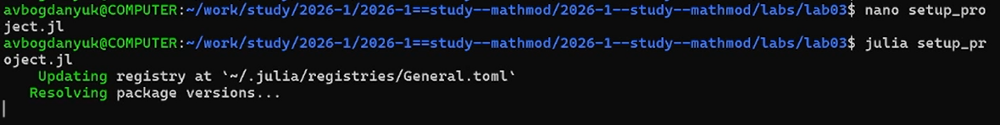
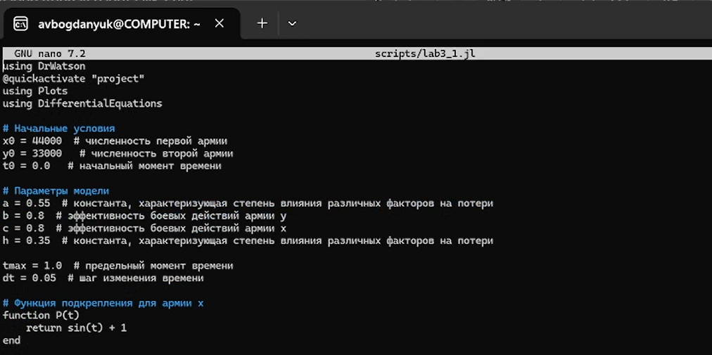
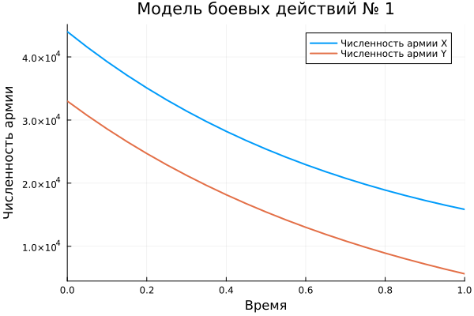
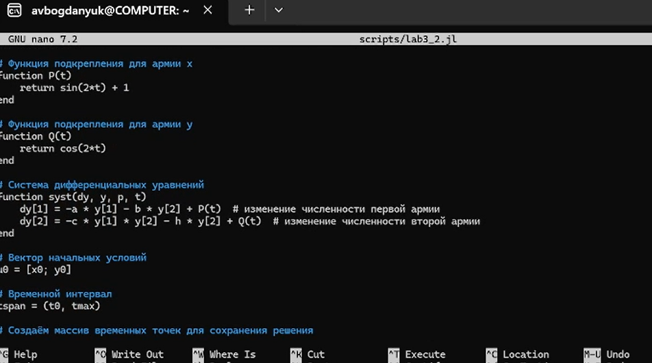
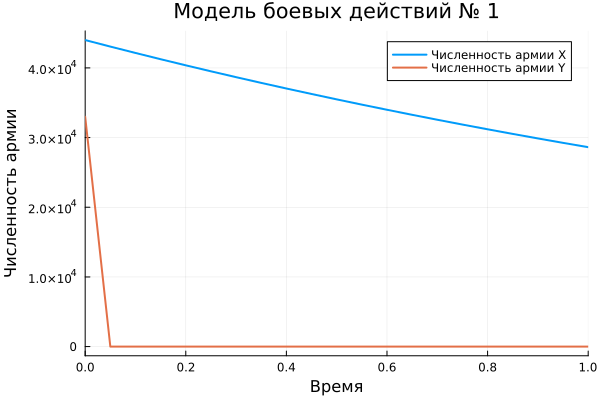

---
## Author
author:
  name: Богданюк Анна Васильевна
  degrees: НКНбд-01-23
  affiliation:
    - name: Российский университет дружбы народов
      country: Российская Федерация
## Title
title: "Лабораторная работа 3. Вариант 23."
subtitle: "Математическое моделирование"
date-format: "2026-03-17"
---

# Вводная часть

## Цель работы

Целью данной лабораторной работы является создание моделей боевых действий между регулярными войсками и боевых действий с участием регулярных войск и партизанских отрядов.

# Основная часть

## Модель боевых действий

Рассмотрим некоторые простейшие модели боевых действий – модели Ланчестера. В противоборстве могут принимать участие как регулярные войска, так и партизанские отряды. В общем случае главной характеристикой соперников являются численности сторон. Если в какой-то момент времени одна из численностей обращается в нуль, то данная сторона считается проигравшей (при условии, что численность другой стороны в данный момент положительна).
Рассмотри три случая ведения боевых действий:
1. Боевые действия между регулярными войсками
2. Боевые действия с участием регулярных войск и партизанских отрядов
3. Боевые действия между партизанскими отрядами

## Модель боевых действий

В первом случае численность регулярных войск определяется тремя
факторами:
- скорость уменьшения численности войск из-за причин, не связанных с боевыми действиями (болезни, травмы, дезертирство);
- скорость потерь, обусловленных боевыми действиямипротивоборствующих сторон (что связанно с качеством стратегии,
уровнем вооружения, профессионализмом солдат и т.п.);
- скорость поступления подкрепления (задаётся некоторой функцией от времени).

## Модель боевых действий

В этом случае модель боевых действий между регулярными войсками описывается следующим образом
$$
\begin{cases}
\frac{dx}{dt} &= -a(t)x(t) - b(t)y(t) + P(t) \tag{1} \\
\frac{dy}{dt} &= -c(t)x(t) - h(t)y(t) + Q(t)
\end{cases}
$$

*   \(x(t), y(t)\) — численности армий \(X\) и \(Y\) в момент времени \(t\).
*   \(a(t), h(t)\) — коэффициенты, характеризующие потери, не связанные с боевыми действиями.
*   \(b(t)\) — эффективность (скорость) потерь армии \(X\) от боевых действий армии \(Y\).
*   \(c(t)\) — эффективность (скорость) потерь армии \(Y\) от боевых действий армии \(X\).
*   \(P(t), Q(t)\) — функции, описывающие скорость подхода подкрепления к армиям \(X\) и \(Y\) соответственно.

## Модель с участием регулярных войск и партизанских отрядов

Во втором случае в борьбу добавляются партизанские отряды. Нерегулярные войска в отличие от постоянной армии менее уязвимы, так как действуют скрытно. В этом случае сопернику приходится действовать неизбирательно, по площадям, занимаемым партизанами. Поэтому считается, что темп потерь партизан, проводящих свои операции в разных местах на некоторой известной территории, пропорционален не только численности армейских соединений, но и численности самих партизан. В результате модель принимает вид:

$$
\begin{cases}
\frac{dx}{dt} &= -a(t)x(t) - b(t)y(t) + P(t) \tag{2} \\
\frac{dy}{dt} &= -c(t)x(t)y(t) - h(t)y(t) + Q(t)
\end{cases}
$$

В этой системе все величины имеют тот же смысл, что и в системе (1).

## Модель боевых действий между партизанскими отрядами

Модель ведения боевых действий между партизанскими отрядами с учетом предположений, сделанных в предыдущем случае, имеет вид:

$$
\begin{cases}
\frac{dx}{dt} &= -a(t)x(t) - b(t)x(t)y(t) + P(t) \tag{3} \\
\frac{dy}{dt} &= -h(t)y(t) - c(t)x(t)y(t) + Q(t)
\end{cases}
$$

## Выполнение работы

Для начала создаём директорию project для работы с помощью кода на языке Julia ([рис. @fig-001]).

{#fig-001 width=70%}

## Выполнение работы

Нам необходимо промоделировать боевые действия между регулярными войсками X и Y. Для этого напишу скрипт lab3_1.jl ([рис. @fig-002]).

{#fig-002 width=70%}

## Выполнение работы

Это график, который у меня получился, в результате работы скрипта. Он графически представляет модель борьбы между регулярными войсками, описанное системой дифференциальных уравнений ([рис. @fig-003]).

{#fig-003 width=70%}

## Выполнение работы

Нам необходимо промоделировать боевые действия с участием регулярных войск и партизанских отрядов. Для этого напишу скрипт lab3_2.jl ([рис. @fig-004]).

{#fig-004 width=70%}

## Выполнение работы

Это график, который у меня получился, в результате работы скрипта. Он графически представляет модель борьбы между регулярными войсками с участием партизанских отрядов, описанное системой дифференциальных уравнени ([рис. @fig-005]).

{#fig-005 width=70%}

## Выводы

В ходе выполнения лабораторной работы были созданы модели боевых действий между регулярными войсками и боевых действий с участием регулярных войск и партизанских отрядов.

## Список литературы{.unnumbered}

1. Кулябов Д. С. Лабораторная работа №3: https://esystem.rudn.ru/course/view.php?id=5930

