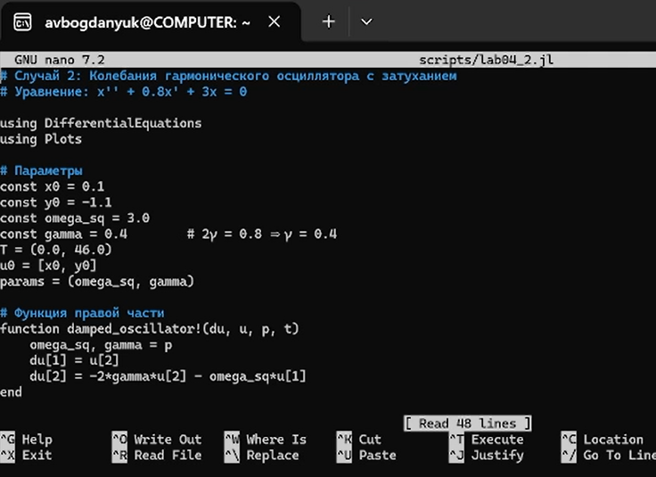
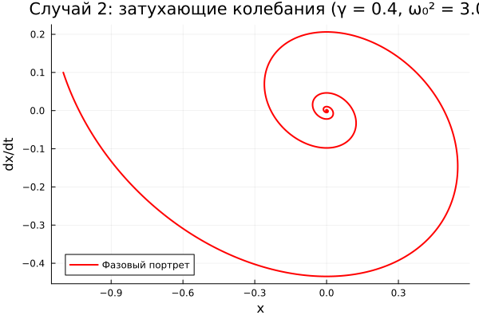
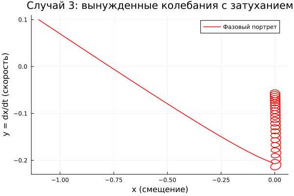
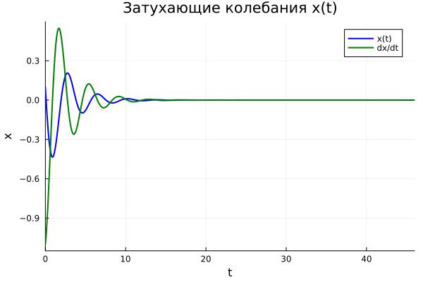
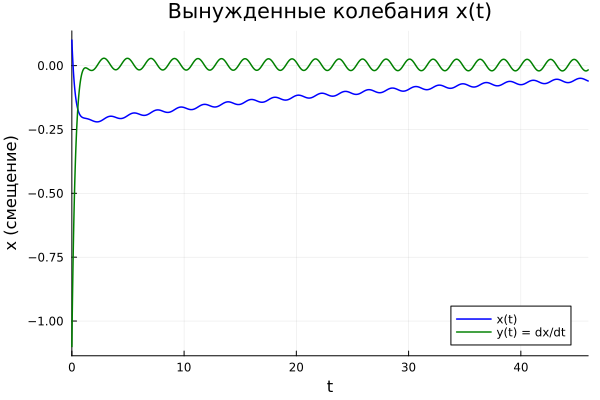

---
## Author
author:
  name: Богданюк Анна Васильевна
  degrees: НКНбд-01-23
  affiliation:
    - name: Российский университет дружбы народов
      country: Российская Федерация
## Title
title: "Лабораторная работа 4. Вариант 23."
subtitle: "Математическое моделирование"
date-format: "2026-04-04"
---

# Вводная часть

## Цель работы

Целью данной лабораторной работы является построение фазового портрета гармонического осциллятора и решение уравнения гармонического осциллятора для нескольких случаев.

# Основная часть

## Вопросы к лабораторной работе 

## 1. Запишите простейшую модель гармонических колебаний

Простейшая модель гармонических колебаний описывается дифференциальным уравнением второго порядка:

$$ \ddot{x} + \omega_0^2 x = 0 $$

где:
- $x$ — переменная, описывающая состояние системы (смещение грузика, заряд конденсатора и т.д.)
- $\omega_0$ — собственная частота колебаний

## 2. Дайте определение осциллятора

**Осциллятор** (от лат. *oscillo* — качаюсь) — это физическая система, совершающая колебания около положения равновесия.

**Линейный гармонический осциллятор** — это модель, которая описывает колебательные процессы в различных системах: механических (груз на пружине, маятник), электрических (колебательный контур), биологических и химических системах.

## 3. Запишите модель математического маятника

**Математический маятник** — это идеализированная система, состоящая из материальной точки массой $m$, подвешенной на невесомой нерастяжимой нити длиной $l$ в поле силы тяжести с ускорением свободного падения $g$.

## 4. Запишите алгоритм перехода от дифференциального уравнения второго порядка
к двум дифференциальным уравнениям первого порядка

Рассмотрим дифференциальное уравнение второго порядка общего вида:

$$ \ddot{x} + a\dot{x} + bx = f(t) $$

## Алгоритм перехода

**Шаг 1:** Введем новую переменную $y$, равную первой производной от $x$:

$$ y = \dot{x} $$

**Шаг 2:** Выразим вторую производную $\ddot{x}$ через $y$:

$$ \dot{y} = \ddot{x} $$

**Шаг 3:** Подставим в исходное уравнение:

$$ \dot{y} + a y + b x = f(t) $$

## Алгоритм 

**Шаг 4:** Выразим $\dot{y}$:

$$ \dot{y} = f(t) - a y - b x $$

**Шаг 5:** Запишем полученную систему двух уравнений первого порядка:

$$ \begin{cases} \dot{x} = y \\ \dot{y} = f(t) - a y - b x \end{cases} $$

## 5. Что такое фазовый портрет и фазовая траектория?

**Фазовый портрет** — это совокупность всех возможных фазовых траекторий системы, соответствующих различным начальным условиям. Фазовый портрет дает полную качественную картину поведения динамической системы.

**Фазовая траектория** — это кривая в фазовом пространстве, которую описывает точка, соответствующая состоянию системы, при изменении времени. Каждая точка на фазовой траектории соответствует определенному состоянию системы в конкретный момент времени.

## Выполнение работы

Для начала создаю рабочее пространство для работы. Затем создаю первый скрипт для создания фазового портрета и решения дифференциального уравнения для колебания гармонического осциллятора без затухания и без воздействия внешних сил ([рис. @fig-001]).

{#fig-001 width=70%}

## Выполнение работы

Cоздаю первый скрипт для создания фазового портрета и решения дифференциального уравнения для колебания гармонического осциллятора c затухания и без воздействия внешних сил ([рис. @fig-002]).

{#fig-002 width=70%}

## Выполнение работы

Cоздаю первый скрипт для создания фазового портрета и решения дифференциального уравнения для колебания гармонического осциллятора c затухания и при воздействии внешних сил ([рис. @fig-003]).

{#fig-003 width=70%}

## Выполнение работы

Фазовый портрет для случая без затухания, описывается уравнением x'' + 1.5*x = 0 ([рис. @fig-004]).

{#fig-004 width=70%}

## Выполнение работы

Фазовый портрет для случая с затухания, описывается уравнением x'' + 0.8*x' +3*x = 0 ([рис. @fig-005]).

{#fig-005 width=70%}

## Выполнение работы

Фазовый портрет для случая с затухания и при воздействии внешних сил, описывается уравнением x'' + 3.3*x' + 0.1*x = 0.1*sin(3*t) ([рис. @fig-006]).

{#fig-006 width=70%}

## Выполнение работы

Решение уравнения гармонического осциллятора для случая без затухания, описывается уравнением x'' + 1.5*x = 0 ([рис. @fig-007]).

{#fig-007 width=70%}

## Выполнение работы

Решение уравнения гармонического осциллятора для случая c затухания, описывается уравнением x'' + 0.8*x' +3*x = 0 ([рис. @fig-008]).

{#fig-008 width=70%}

## Выполнение работы

Решение уравнения гармонического осциллятора для случая с затухания и при воздействии внешних сил, описывается уравнением x'' + 3.3*x' + 0.1*x = 0.1*sin(3*t) ([рис. @fig-009]).

{#fig-009 width=70%}

## Выводы

В ходе выполнения лабораторной работы были построены фазовые портреты гармонического осциллятора и были решены уравнения гармонического осциллятора для разных случаев (с затуханием, без затухания, с воздействием внешней среды и без).

## Список литературы{.unnumbered}

1. Кулябов Д. С. Лабораторная работа №4: https://esystem.rudn.ru/pluginfile.php/3094575/mod_resource/content/2/%D0%9B%D0%B0%D0%B1%D0%BE%D1%80%D0%B0%D1%82%D0%BE%D1%80%D0%BD%D0%B0%D1%8F%20%D1%80%D0%B0%D0%B1%D0%BE%D1%82%D0%B0%20%E2%84%96%203.pdf

