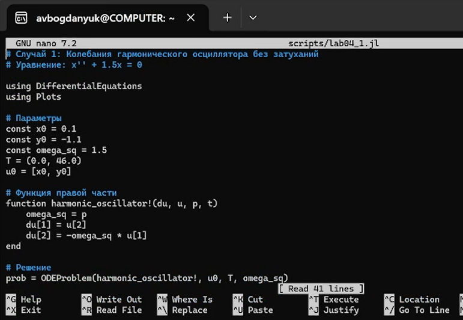
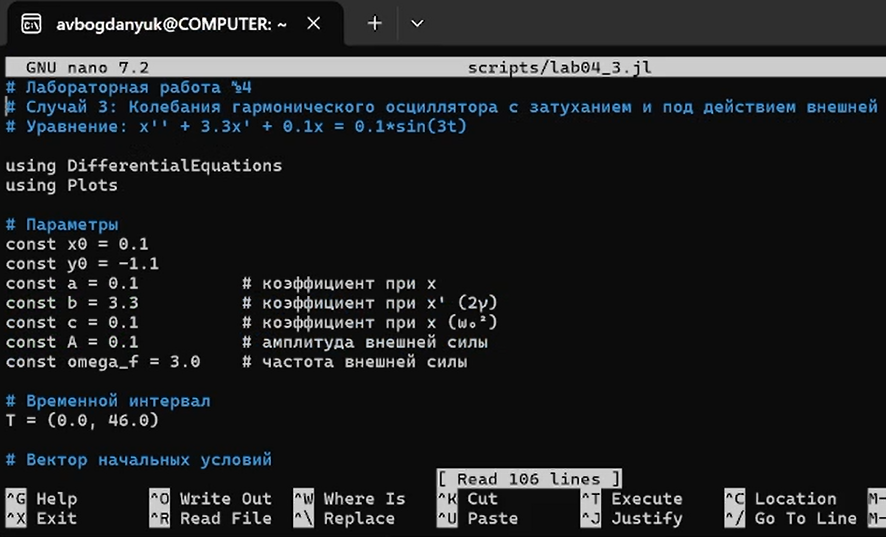
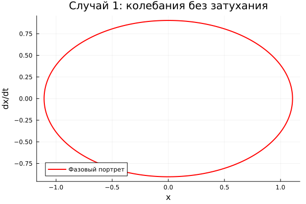
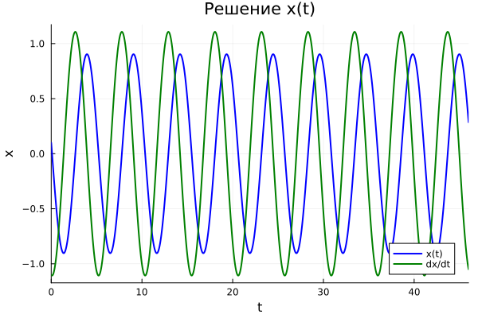

---
## Author
author:
  name: Богданюк Анна
  degrees: НКНбд-01-23
  affiliation:
    - name: Российский университет дружбы народов
      country: Российская Федерация

## Title
title: "Лабораторная работа 4. Вариант 23."
subtitle: "Математическое моделирование"
license: "CC BY"
---

# Цель работы

Целью данной лабораторной работы является построение фазового портрета гармонического осциллятора и решение уравнения гармонического осциллятора для нескольких случаев.
 
# Задание

Постройте фазовый портрет гармонического осциллятора и решение уравнения гармонического осциллятора для следующих случаев:

1. Колебания гармонического осциллятора без затуханий и без действий внешней силы x'' + 1.5*x = 0
2. Колебания гармонического осциллятора c затуханием и без действий внешней силы x'' + 0.8*x' +3*x = 0
3. Колебания гармонического осциллятора c затуханием и под действием внешней силы x'' + 3.3*x' + 0.1*x = 0.1*sin(3*t)

На интервале t принадлежит [0; 46] (шаг 0.05) с начальными условиями x0 = 0.1, y0=-1.1

# Вопросы к лабораторной работе 

1. Запишите простейшую модель гармонических колебаний

Простейшая модель гармонических колебаний описывается дифференциальным уравнением второго порядка:

$$ \ddot{x} + \omega_0^2 x = 0 $$

где:
- $x$ — переменная, описывающая состояние системы (смещение грузика, заряд конденсатора и т.д.)
- $\omega_0$ — собственная частота колебаний

2. Дайте определение осциллятора

**Осциллятор** (от лат. *oscillo* — качаюсь) — это физическая система, совершающая колебания около положения равновесия.

**Линейный гармонический осциллятор** — это модель, которая описывает колебательные процессы в различных системах: механических (груз на пружине, маятник), электрических (колебательный контур), биологических и химических системах.

3. Запишите модель математического маятника

**Математический маятник** — это идеализированная система, состоящая из материальной точки массой $m$, подвешенной на невесомой нерастяжимой нити длиной $l$ в поле силы тяжести с ускорением свободного падения $g$.

4. Запишите алгоритм перехода от дифференциального уравнения второго порядка
к двум дифференциальным уравнениям первого порядка

Рассмотрим дифференциальное уравнение второго порядка общего вида:

$$ \ddot{x} + a\dot{x} + bx = f(t) $$

### Алгоритм перехода

**Шаг 1:** Введем новую переменную $y$, равную первой производной от $x$:

$$ y = \dot{x} $$

**Шаг 2:** Выразим вторую производную $\ddot{x}$ через $y$:

$$ \dot{y} = \ddot{x} $$

**Шаг 3:** Подставим в исходное уравнение:

$$ \dot{y} + a y + b x = f(t) $$

**Шаг 4:** Выразим $\dot{y}$:

$$ \dot{y} = f(t) - a y - b x $$

**Шаг 5:** Запишем полученную систему двух уравнений первого порядка:

$$ \begin{cases} \dot{x} = y \\ \dot{y} = f(t) - a y - b x \end{cases} $$

5. Что такое фазовый портрет и фазовая траектория?

**Фазовый портрет** — это совокупность всех возможных фазовых траекторий системы, соответствующих различным начальным условиям. Фазовый портрет дает полную качественную картину поведения динамической системы.

**Фазовая траектория** — это кривая в фазовом пространстве, которую описывает точка, соответствующая состоянию системы, при изменении времени. Каждая точка на фазовой траектории соответствует определенному состоянию системы в конкретный момент времени.

# Теоретическое введение

Движение грузика на пружинке, маятника, заряда в электрическом контуре, а также эволюция во времени многих систем в физике, химии, биологии и других науках при определенных предположениях можно описать одним и тем же дифференциальным уравнением, которое в теории колебаний выступает в качестве основной модели. Эта модель называется **линейным гармоническим осциллятором**.

## Уравнение гармонического осциллятора

Уравнение свободных колебаний гармонического осциллятора имеет следующий вид:

$$ \ddot{x} + 2\gamma \dot{x} + \omega_0^2 x = 0 \qquad (1) $$

где:

- $x$ — переменная, описывающая состояние системы (смещение грузика, заряд конденсатора и т.д.)
- $\gamma$ — параметр, характеризующий потери энергии (трение в механической системе, сопротивление в контуре)
- $\omega_0$ — собственная частота колебаний
- $t$ — время

## Консервативный осциллятор

При отсутствии потерь в системе ($\gamma = 0$) вместо уравнения (1) получаем уравнение консервативного осциллятора, энергия колебаний которого сохраняется во времени:

$$ \ddot{x} + \omega_0^2 x = 0 \qquad (2) $$

## Начальные условия

Для однозначной разрешимости уравнения второго порядка (2) необходимо задать два начальных условия вида:

$$ \left\{ \begin{array}{l} x(t_0) = x_0 \\ \dot{x}(t_0) = y_0 \end{array} \right. \qquad (3) $$

## Система уравнений первого порядка

Уравнение второго порядка (2) можно представить в виде системы двух уравнений первого порядка:

$$ \left\{ \begin{array}{l} \dot{x} = y \\ \dot{y} = -\omega_0^2 x \end{array} \right. \qquad (4) $$

Начальные условия (3) для системы (4) примут вид:

$$ \left\{ \begin{array}{l} x(t_0) = x_0 \\ y(t_0) = y_0 \end{array} \right. \qquad (5) $$

## Фазовое пространство

Независимые переменные $x$, $y$ определяют пространство, в котором «движется» решение. Это **фазовое пространство** системы. Поскольку оно двумерно, будем называть его **фазовой плоскостью**.

Значение фазовых координат $x$, $y$ в любой момент времени полностью определяет состояние системы. Решению уравнения движения как функции времени отвечает гладкая кривая в фазовой плоскости. Она называется **фазовой траекторией**.

Если множество различных решений (соответствующих различным начальным условиям) изобразить на одной фазовой плоскости, возникает общая картина поведения системы. Такую картину, образованную набором фазовых траекторий, называют **фазовым портретом**.

# Выполнение лабораторной работы

Для начала создаю рабочее пространство для работы. Затем создаю первый скрипт для создания фазового портрета и решения дифференциального уравнения для колебания гармонического осциллятора без затухания и без воздействия внешних сил ([рис. @fig-001]).

{#fig-001 width=70%}

Cоздаю первый скрипт для создания фазового портрета и решения дифференциального уравнения для колебания гармонического осциллятора c затухания и без воздействия внешних сил ([рис. @fig-002]).

{#fig-002 width=70%}

Cоздаю первый скрипт для создания фазового портрета и решения дифференциального уравнения для колебания гармонического осциллятора c затухания и при воздействии внешних сил ([рис. @fig-003]).

{#fig-003 width=70%}

Фазовый портрет для случая без затухания, описывается уравнением x'' + 1.5*x = 0 ([рис. @fig-004]).

{#fig-004 width=70%}

Фазовый портрет для случая с затухания, описывается уравнением x'' + 0.8*x' +3*x = 0 ([рис. @fig-005]).

{#fig-005 width=70%}

Фазовый портрет для случая с затухания и при воздействии внешних сил, описывается уравнением x'' + 3.3*x' + 0.1*x = 0.1*sin(3*t) ([рис. @fig-006]).

{#fig-006 width=70%}

Решение уравнения гармонического осциллятора для случая без затухания, описывается уравнением x'' + 1.5*x = 0 ([рис. @fig-007]).

{#fig-007 width=70%}

Решение уравнения гармонического осциллятора для случая c затухания, описывается уравнением x'' + 0.8*x' +3*x = 0 ([рис. @fig-008]).

{#fig-008 width=70%}

Решение уравнения гармонического осциллятора для случая с затухания и при воздействии внешних сил, описывается уравнением x'' + 3.3*x' + 0.1*x = 0.1*sin(3*t) ([рис. @fig-009]).

{#fig-009 width=70%}

# Выводы

В ходе выполнения лабораторной работы были построены фазовые портреты гармонического осциллятора и были решены уравнения гармонического осциллятора для разных случаев (с затуханием, без затухания, с воздействием внешней среды и без).

# Список литературы{.unnumbered}

1. Кулябов Д. С. Лабораторная работа №4: https://esystem.rudn.ru/pluginfile.php/3094575/mod_resource/content/2/%D0%9B%D0%B0%D0%B1%D0%BE%D1%80%D0%B0%D1%82%D0%BE%D1%80%D0%BD%D0%B0%D1%8F%20%D1%80%D0%B0%D0%B1%D0%BE%D1%82%D0%B0%20%E2%84%96%203.pdf
