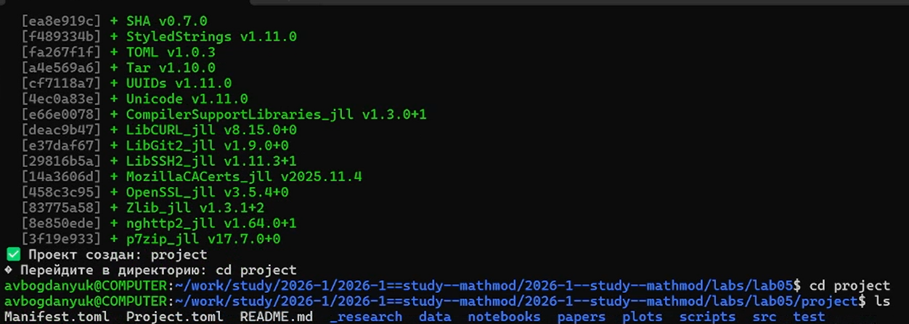
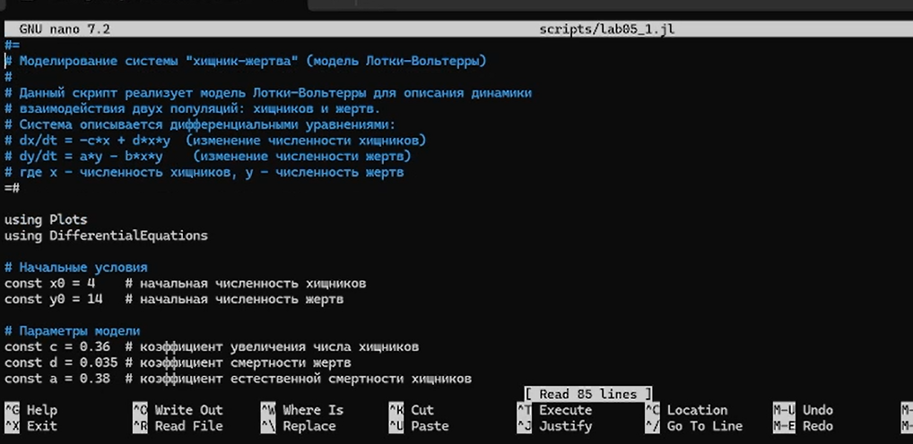
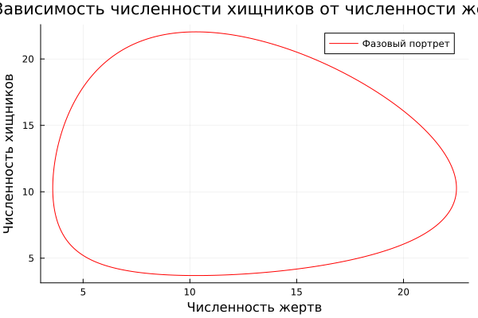
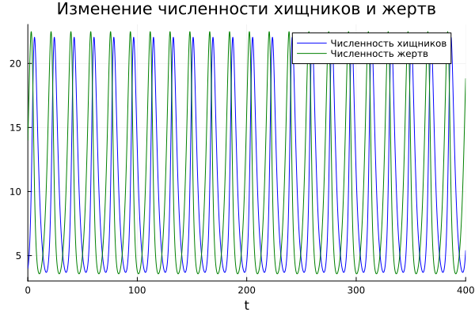

---
## Author
author:
  name: Богданюк Анна Васильевна
  degrees: НКНбд-01-23
  affiliation:
    - name: Российский университет дружбы народов
      country: Российская Федерация
## Title
title: "Лабораторная работа 5. Вариант 23."
subtitle: "Математическое моделирование"
date-format: "2026-04-18"
---

# Вводная часть

## Цель работы

Целью данной лабораторной работы является построение графика зависимости численности хищников от численности жертв, а также график изменения численности хищников и численности жертв при начальных услових: x(0) = 4, y(0) = 14.

## Задание

Для модели «хищник-жертва»:

$$
\frac{dx}{dt} = -0{,}38 \cdot x(t) + 0{,}037 \cdot x(t) \cdot y(t)
$$

$$
\frac{dy}{dt} = 0{,}36 \cdot y(t) - 0{,}035 \cdot x(t) \cdot y(t)
$$

Постройте график зависимости численности хищников от численности жертв, а также графики изменения численности хищников и численности жертв при следующих начальных условиях: x(0) = 4, y(0) = 14. Найдите стационарное состояние системы.

# Основная часть

## Выполнение работы

Для начала создаю рабочее пространство для работы ([рис. @fig-001]).

{#fig-001 width=70%}

## Выполнение работы

Создаю скрипт для моделирование борьбы за существование хищников и жертв ([рис. @fig-002]).

{#fig-002 width=70%}

## Выполнение работы

График зависимости численности хищников от численности жертв ([рис. @fig-003]).

{#fig-003 width=70%}

## Выполнение работы

График изменения численности хищников и жертв ([рис. @fig-004]).

{#fig-004 width=70%}

## Выводы

В ходе выполнения лабораторной работы были построены графики зависимости численности хищников от численности жертв, а также график изменения численности хищников и численности жертв при начальных услових: x(0) = 4, y(0) = 14.

## Список литературы{.unnumbered}

1. Вольтерра B. Математическая теория борьбы за существование : пер. с фр. — М. : Наука, 1976.. — 288 с. — Пер. по изд.: Volterra V. Leçons sur la Théorie mathématique de la lutte pour la vie. — Paris : Gauthiers-Villars, 1931. — ISBN 2876470667. — URL : http://www.amazon.com/lecons-theorie-math-lutte-pour/d p/2876470667%3FSubscriptionId%3D0JYN1NVW651KCA56C102%26tag%3Dtechkie-20%26linkCode%3Dxm2%26camp%3D2025%26creative%3D165953%26creativeASIN%3D2876470667.
2. Volterra V. Variations and fluctuations of the number of individuals in animal species living together // Journal du Conseil permanent International pour l Exploration de la Mer. — 1928. — Vol. 3, no. 1. — P. 3–51.

