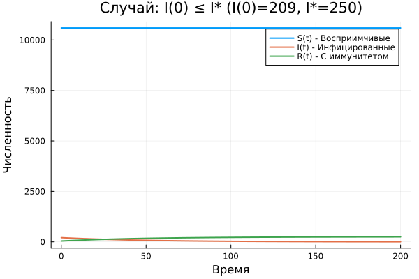
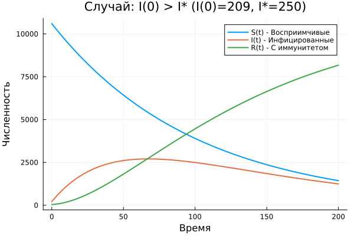

---
## Author
author:
  name: Богданюк Анна Васильевна
  degrees: НКНбд-01-23
  affiliation:
    - name: Российский университет дружбы народов
      country: Российская Федерация
## Title
title: "Лабораторная работа 6. Вариант 23."
subtitle: "Математическое моделирование"
date-format: "2026-05-02"
---

# Вводная часть

## Цель работы

Целью данной лабораторной работы является построение графиков изменения числа особей в каждой из трех групп. Рассмотреть, как будет протекать эпидемия в случае: 1) если I(0)<I*; 2) если I(0)>I*.

## Задание

Вариант 23.

На одном острове вспыхнула эпидемия. Известно, что из всех проживающих
на острове (N=10 850) в момент начала эпидемии (t=0) число заболевших людей
(являющихся распространителями инфекции) I(0)=209, А число здоровых людей с
иммунитетом к болезни R(0)=42. Таким образом, число людей восприимчивых к
болезни, но пока здоровых, в начальный момент времени S(0)=N-I(0)- R(0).
Постройте графики изменения числа особей в каждой из трех групп.
Рассмотрите, как будет протекать эпидемия в случае:
1) если I(0) <= I*
2) если I(0) > I*

## Теоретическое введение

Предположим, что некая популяция, состоящая из N особей, (считаем, что популяция изолирована) подразделяется на три группы.

- S(t) — восприимчивые к болезни, но пока здоровые особи
- I(t) — это число инфицированных особей, которые также при этом являются распространителями инфекции
- R(t) — это здоровые особи с иммунитетом к болезни.

До того, как число заболевших не превышает критического значения I считаем, что все больные изолированы и не заражают здоровых. Когда I(t)>I*, тогда инфицирование способны заражать восприимчивых к болезни особей.

## Теоретическое введение

Таким образом, скорость изменения числа S(t) меняется по следующему закону:
$$
 \frac{\partial S}{\partial t} = \begin{cases} - \alpha S, если \ I(t)>I^* \\ 0, если \ I(t) \leq I^* \end{cases}
$$
Поскольку каждая восприимчивая к болезни особь, которая, в конце концов, заболевает, сама становится инфекционной, то скорость изменения числа инфекционных особей представляет разность за единицу времени между заразившимися и теми, кто уже болеет и лечится, т.е.:
$$
 \frac{\partial I}{\partial t} = \begin{cases} \alpha S - \beta I, если \ I(t)>I^* \\  - \beta I, если \ I(t) \leq I^* \end{cases}
$$
А скорость изменения выздоравливающих особей (при этом приобретающие иммунитет к болезни)
$$
\frac{\partial R}{\partial t} = \beta I
$$

## Теоретическое введение

Постоянные пропорциональности:

- $\alpha$ — коэффициент заболеваемости

- $\beta$ — коэффициент выздоровления

# Основная часть

## Выполнение работы

Для начала создаю рабочее пространство для работы ([рис. @fig-001]).

{#fig-001 width=70%}

## Выполнение работы

Создаю файл SIR_lab06.jl для того, чтобы построить графики и симулировать модель SIR ([рис. @fig-002]).

{#fig-002 width=70%}

## Выполнение работы

График протекания эпидемии, если I(0) < I* ([рис. @fig-003]).

{#fig-003 width=70%}

## Выполнение работы

График протекания эпидемии, если I(0)> I* ([рис. @fig-004]).

{#fig-004 width=70%}

## Выводы

В ходе выполнения лабораторной работы были построены графики изменения числа особей в каждой из трех групп. Рассмотрено, как будет протекать эпидемия в случае: 1) если I(0)<I*; 2) если I(0)>I*.

## Список литературы{.unnumbered}

1. Hethcote H. W. The Mathematics of Infectious Diseases // SIAM Review. — 2000. — Jan. — Vol. 42, no. 4. — P. 599–653. — ISSN 1095-7200. — DOI: 10.1137/s0036144500371907.
2. Kermack W. O., McKendrick A. G. A Contribution to the Mathematical Theory of Epidemics // Proceedings of the Royal Society of London. Series A Containing Papers of a Mathematical and Physical Character. — 1927. — Авг. — Т. 115, № 772. — С. 700—721. — ISSN 2053-9150. — DOI: 10.1098/rspa.1927.0118.
