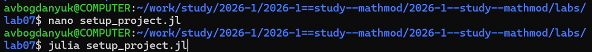
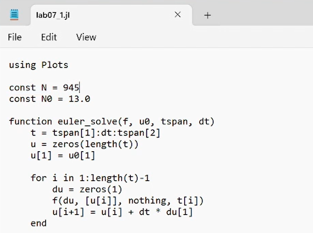
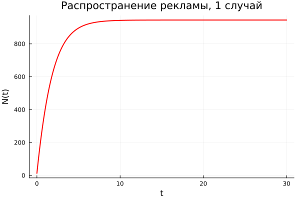
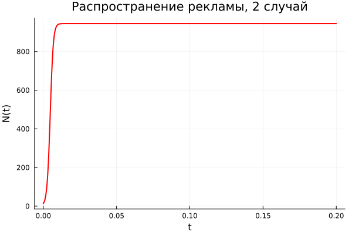
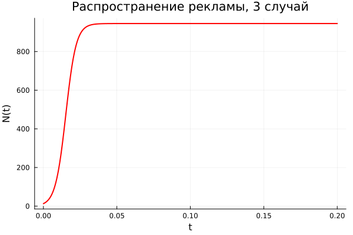

---
## Author
author:
  name: Богданюк Анна Васильевна
  degrees: НКНбд-01-23
  affiliation:
    - name: Российский университет дружбы народов
      country: Российская Федерация
## Title
title: "Лабораторная работа 7. Вариант 23."
subtitle: "Математическое моделирование"
date-format: "2026-05-16"
---

# Вводная часть

## Цель работы

Целью данной лабораторной работы является построение графика распростронения рекламы, математическая модель которой описывается следующими уравнением:
1. $$\frac{dn}{dt} = (0{,}51 + 0{,}000099 \cdot n(t))(N-n(t))$$
2. $$\frac{dn}{dt} = (0{,}000019 + 0{,}99 \cdot n(t))(N-n(t))$$
3. $$\frac{dn}{dt} = (0{,}99 \cdot t + 0{,}3 \cdot cos(4t)0{,}99 \cdot n(t))(N-n(t))$$
При этом объем аудитории N = 945, в начальный момент о товаре знает 13 человек. Для случая 2 определите в какой момент времени скорость распространения рекламы будет иметь максимальное значение.

# Основная часть

## Выполнение работы

Для начала создаю рабочее пространство для работы ([рис. @fig-001]).

{#fig-001 width=70%}

## Выполнение работы

Затем пишу программу для реализации модели распростронения рекламы ([рис. @fig-002]).

{#fig-002 width=70%}

## Выполнение работы

Первый случай модели, где alpha1 больше alpha2 ([рис. @fig-003]).

{#fig-003 width=70%}

## Выполнение работы

Второй случай модели, где alpha2 больше alpha1 ([рис. @fig-004]).

{#fig-004 width=70%}

## Выполнение работы

Третий случай модели ([рис. @fig-005]).

{#fig-005 width=70%}

## Выводы

В ходе выполнения лабораторной работы были построены графики распростронения рекламы, математическая модель которой описывается следующими уравнением:
1. $$\frac{dn}{dt} = (0{,}51 + 0{,}000099 \cdot n(t))(N-n(t))$$
2. $$\frac{dn}{dt} = (0{,}000019 + 0{,}99 \cdot n(t))(N-n(t))$$
3. $$\frac{dn}{dt} = (0{,}99 \cdot t + 0{,}3 \cdot cos(4t)0{,}99 \cdot n(t))(N-n(t))$$
При этом объем аудитории N = 945, в начальный момент о товаре знает 13 человек. Для случая 2 определите в какой момент времени скорость распространения рекламы будет иметь максимальное значение.
